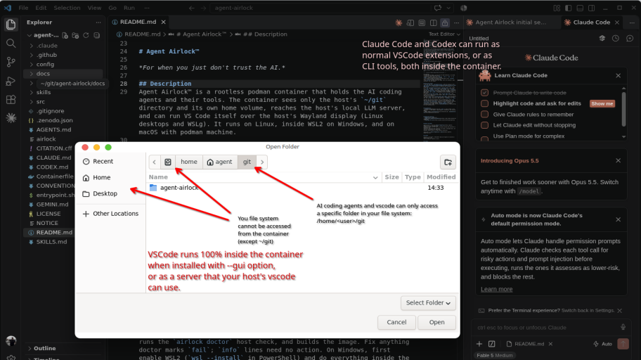

<!--
This file is part of Agent Airlock™
README.md
Author(s): Gabriel Mongefranco
Created: 2026-01-01
Last Modified: 2026-09-26
Summary: Provides an overview of the project, in Markdown format.
Notes: See README file for documentation and full license information.

Copyright © 2026 Gabriel Mongefranco

This program is free software: you can redistribute it and/or modify
it under the terms of the GNU General Public License as published by
the Free Software Foundation, either version 3 of the License, or (at your option) any later version.
This program is distributed in the hope that it will be useful,
but WITHOUT ANY WARRANTY; without even the implied warranty of
MERCHANTABILITY or FITNESS FOR A PARTICULAR PURPOSE. See the
GNU General Public License for more details.
You should have received a copy of the GNU General Public License along
with this program. If not, see <https://www.gnu.org/licenses/>.

-->

# Agent Airlock™

*For when you just don't trust the AI.*

## Description
Agent Airlock™ is a rootless podman container that holds the AI coding agents and their tools. The container sees only the host's `~/git` directory and its own home volume, reaches the host's local LLM server, and can run VS Code itself over the host's Wayland display (Linux desktops and WSLg). It runs on Linux, inside WSL2 on Windows, and on macOS with podman machine.

***This project is under development as of 2026 and not yet ready to use.***

<!--  -->

Key features:
+ Claude Code and Codex, as CLIs and as VS Code extensions, run inside the container with their MCP servers.
+ Agents can install tools with `sudo apt`, `npm -g`, `pipx`, or `go install` without touching the host system.
+ Test servers inside the container are published to host `localhost` only, so the host browser can open them.
+ One `airlock` launcher builds the image, starts the container, opens the editor, and runs logins.

## Quick Start Guide
1. Get the code into `~/git/agent-airlock`, either by cloning it with `git clone https://github.com/gabrielmongefranco/agent-airlock.git ~/git/agent-airlock` or by downloading the repository and unzipping it into that folder.
2. Run `cd ~/git/agent-airlock && bash ./airlock install --gui` (leave out `--gui` on macOS). Install offers to add podman if it is missing (using `dnf`, `apt-get`, or `brew`), links `airlock` into `~/.local/bin`, runs the `airlock doctor` host check, and builds the image. Fix anything doctor marks `fail`; `info` lines need no action. On Windows, first enable WSL2 (`wsl --install` in PowerShell) and do everything inside the WSL2 distro.
3. Log in: `airlock login claude`, then `airlock login codex`. Each prints a URL to open in your host browser. Type `/exit` to leave Claude Code once it is signed in.
4. Open the editor with `airlock vscode ~/git/<repo>`. When the container runs with `--gui`, this runs VS Code inside it; otherwise it attaches your host VS Code. Force one or the other with `--container` or `--host`.

Commands that need the container start it automatically, with `--gui` when the image was built with it, so there is no separate start step; `airlock up` and `airlock down` control it by hand. On Fedora, the first start offers a one-time SELinux relabel of `~/git`; accept it. Run `airlock help` for every command, `airlock uninstall` to remove everything install added, and see [troubleshooting](docs/troubleshooting.md) when something fails.

## Documentation
+ **Complete documentation:** See the [`/docs`](./docs) folder in this repository for setup guides, usage examples, architecture, and technical details.
+ **Major pages:** [Architecture](docs/architecture.md), [Implementation plan](docs/implementation-plan.md).

## Additional Resources
+ [Podman](https://podman.io/)
+ [Claude Code sandboxing documentation](https://code.claude.com/docs/en/sandboxing)
+ [Playwright MCP server](https://github.com/microsoft/playwright-mcp)

## About the Author

Agent Airlock™ is built by [Gabriel Mongefranco](https://gabriel.mongefranco.com), a database and
software architect who has spent two decades building data platforms in healthcare and
research — enterprise data warehouses, BI systems, knowledge bases, and the first architecture for mobile and
wearable research data at a large research university.

Learn more at: [Gabriel Mongefranco's website](https://gabriel.mongefranco.com).

## Contact

Questions, bug reports, enhancement ideas and requests are welcome as GitHub issues. Feel
free to send pull requests as well!

## Credits
### Authors:
+ [Gabriel Mongefranco](https://gabriel.mongefranco.com) [(@gabrielmongefranco)](https://github.com/gabrielmongefranco)

#### This work is based in part on the following projects, libraries and/or studies:
+ None

## License
### Copyright Notice
Copyright © 2026 Gabriel Mongefranco

### Software and Library License Notice
This program is free software: you can redistribute it and/or modify it under the terms of the GNU General Public License as published by the Free Software Foundation, either version 3 of the License, or (at your option) any later version.

This program is distributed in the hope that it will be useful, but WITHOUT ANY WARRANTY; without even the implied warranty of MERCHANTABILITY or FITNESS FOR A PARTICULAR PURPOSE. See the GNU General Public License for more details.

You should have received a copy of the GNU General Public License along with this program. If not, see <https://www.gnu.org/licenses/gpl-3.0-standalone.html>.

Files that cannot hold a comment carry their license notice in a sibling file instead: `config/claude-settings.json` is covered by `config/claude-settings.json.LICENSE.txt`.

### Documentation License Notice
Permission is granted to copy, distribute and/or modify this document 
under the terms of the GNU Free Documentation License, Version 1.3 
or any later version published by the Free Software Foundation; 
with no Invariant Sections, no Front-Cover Texts, and no Back-Cover Texts. 
You should have received a copy of the license included in the section entitled "GNU 
Free Documentation License". If not, see <https://www.gnu.org/licenses/fdl-1.3-standalone.html>

## Citation
If you find this repository, code or paper useful for your research, please cite it.

#### Citation Example:
>_Mongefranco, Gabriel (2026). Agent Airlock™. Software. https://github.com/gabrielmongefranco/agent-airlock_

----

Copyright © 2026 Gabriel Mongefranco
