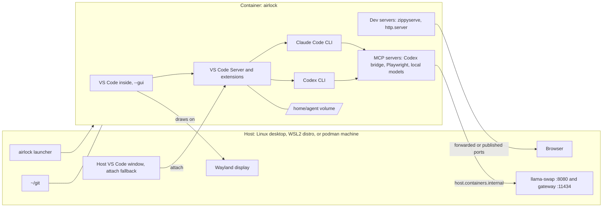

<!--
This file is part of Agent Airlock™
docs/architecture.md
Author(s): Gabriel Mongefranco
Created: 2026-09-23
Last Modified: 2026-10-01
Summary: Describes the airlock: what runs where, what the agents can and
         cannot reach, how the editor connects on each platform, and why the
         other options were not chosen.
Notes: See README file for documentation and full license information.

Copyright © 2026 Gabriel Mongefranco

Licensed under the GNU Free Documentation License v1.3 or later.
See <https://www.gnu.org/licenses/fdl-1.3.html>. See README for full license information.

-->

# Agent Airlock™

## Architecture

[← Back to README](../README.md)

Agent Airlock is a rootless podman container that holds the AI coding agents, their language toolchains, and Playwright. The container sees one host directory, `~/git`, plus its own home volume, and it can reach the host's local LLM server over the network. This page explains the pieces, the boundary, and the reasons behind the design, for whoever maintains the setup next, including an agent reading it cold.

### Overview

The design answers five requirements, in priority order:

1. Agents and their tools can read and write `~/git` and nothing else on the host.
2. The editor stays the native VS Code application.
3. Test servers started from the editor terminal, or by an agent, are reachable from the host browser.
4. Agents can install whatever tools they need without touching the host system.
5. Network limits are optional, because planning agents need web access and coding agents need less.

A container satisfies all five with one image and one `podman run`. The alternatives that were considered are listed under [Decisions](#decisions-and-why).

#### Components

| Component | Runs where | What it does |
|---|---|---|
| `airlock` launcher | Host shell (Linux, WSL2, macOS) | Builds the image, starts the container, opens the editor, runs logins. |
| VS Code inside the container (`--gui`) | Container | The full editor, drawn on the host's Wayland display. Default on Linux desktops and WSLg. |
| Host VS Code (window only), attached | Host | Fallback editor: renders on the host, runs its server inside the container. |
| VS Code Server, extension host, terminals | Container | Every extension you install lands here, whichever transport you use. |
| Claude Code CLI, Codex CLI | Container | Launched by their extensions or from a terminal. They share credential stores with the extensions (`~/.claude`, `~/.codex`). |
| MCP servers (Codex bridge, Playwright, local models) | Container | Children of the agent CLIs. They inherit the container boundary. |
| Toolchains: Node, Python, Go, Lua 5.4, build tools, git, gh, Playwright with Chromium | Container image | Installed at build time. Agents add more with `sudo apt` inside the container. |
| Home volume (`airlock-home`) | podman named volume | `/home/agent`. Holds logins, agent settings, npm and pipx installs, and VS Code Server. Survives container rebuilds. |
| `~/git` bind mount | Host filesystem (or the WSL2 distro's filesystem) | The only host directory the container can see. Files keep the host user's ownership. |
| Local LLM server (llama-swap on 8080, OpenAI-style gateway on 11434) | Host | Reached from the container as `host.containers.internal`. The GPU never enters the container. |

#### Diagram

In words: the launcher starts the container. The editor is either VS Code running inside the container and drawing on the host's Wayland display, or a host VS Code window attached to a VS Code Server inside the container. Either way the server, the two agent extensions, the two CLIs, and their MCP servers all live inside the container, which mounts `~/git` from the host and its own home volume. The MCP servers reach the host's LLM server by hostname. Dev servers inside the container reach the host browser through forwarded or published ports.

### The boundary

#### What agents can reach

- `~/git` on the host, read and write, with files owned by the host user (podman `--userns=keep-id`).
- Their own home, `/home/agent`, on a persistent volume.
- The container's packages, and anything they install with `sudo apt`, `npm -g`, `pipx`, `go install`, or `luarocks`. All of it stays in the container.
- The internet, through podman's default network (pasta). Claude Code's inner sandbox adds a domain allowlist on top; see below.
- The host's local LLM endpoints, by the name `host.containers.internal`.
- Host loopback ports that the launcher publishes: the Codex login callback and a small range for dev servers.
- The host's Wayland display when `--gui` is on.

#### What agents cannot reach

- The rest of the host filesystem, including the host home directory, other users' homes, credential folders, and the host package system. On Windows, the Windows drives are also out of reach when the WSL2 distro runs with `automount` off.
- Host processes. The container has its own PID namespace.

#### Two sandbox layers

The container is the outer boundary and the one that matters. Claude Code adds a second, inner layer for its shell commands. Codex runs without one.

- Claude Code's Bash sandbox (bubblewrap) runs in nested mode inside the container, which the tool's own documentation describes as acceptable when the container provides the isolation. It applies the domain allowlist in `config/claude-settings.json`, hides API keys from shell commands, and runs each command in its own network namespace. Its filesystem layer is off. That layer let commands write only to the folder the editor window had open, and the empty files it placed over protected paths, such as `.git/config.lock`, blocked git and the editor in every process that saw them.
- Codex runs with `sandbox_mode = "danger-full-access"`. Its own sandbox needs bubblewrap to mount a fresh `/proc`, which a rootless container denies, so it cannot start here.

A rules file, `config/claude-airlock-rules.md`, lands in the home volume as `~/.claude/rules/airlock.md`. Claude Code loads it in every session, so agents learn these limits without discovering them by trial and error.

The inner layer covers only the shell commands Claude Code runs. MCP servers, Codex, and the editor run outside it, so a design that relied on inner sandboxes alone would leave the multi-agent workflow (PeerFoil) uncovered. That is the main reason the boundary is a container.

#### Known limits

- On Linux, each command that Claude Code's sandbox wraps gets its own network namespace and loopback, and it cannot use Unix-domain sockets. A server started by one command cannot be reached from a later command, the editor, or the host browser, and a sandboxed command cannot reach a server started at container level. Dev servers, Playwright, and npm and pipx installs are therefore listed in `excludedCommands`, which runs them at container level. That is still inside the boundary.
- Claude Code keeps every command that starts with `sudo` inside its sandbox, where `sudo` cannot run. Installing a package with `sudo apt-get` therefore needs a run outside the sandbox that you approve.
- Nested mode for the inner sandbox exposes process information to sandboxed commands that a fresh `/proc` would hide.
- The inner domain allowlist decides by hostname without inspecting TLS. With the filesystem layer off, a command can also rewrite Claude Code's own settings and turn the allowlist off. It keeps agents honest; it does not stop a determined exfiltration.
- Codex's shell commands have no inner sandbox, so they can write anywhere the container can and reach any host.
- Files under `~/git` that the host runs later are a way out of the airlock. Agents can write git hooks and `.git/config` in every repository, and host git runs them. The same goes for build scripts, and for editor tasks opened in a host editor. Run git for these repositories inside the airlock, where pushing and branch tracking work.
- With `--gui`, the container holds the host's compositor socket and runs with SELinux labeling off. Wayland stops it from reading other windows or injecting input, but it can draw windows and use the clipboard.
- Running the GitHub Actions runner `act` inside the container needs podman inside podman. This is possible but not set up by default; `cargo test` and friends inside the container already reproduce the Linux CI job.

### Editor transports

The boundary is the same whichever way the editor connects. The launcher offers two, and both can be used against the same container.

| Transport | Command | Native window | Where it is the default | Notes |
|---|---|---|---|---|
| VS Code inside the container | `airlock vscode --container` (shorthand: `airlock code`) | Yes | Linux desktops, WSLg on Windows | No attach step; open projects like any editor. Ports are published as a fixed range. Same shape as running the editor inside WSLg. |
| Host VS Code attached | `airlock vscode --host` (shorthand: `airlock open`) | Yes | macOS, and Windows without WSLg | One command opens an attached window. Ports auto-forward. Same shape as Remote-WSL on Windows. |
| `code serve-web` | not provided | No, browser | Nowhere | Rejected for daily use. |

`airlock vscode --host` builds the folder URI the Dev Containers extension uses for attached containers, so no `.devcontainer` folder exists anywhere and nothing is written into repositories.

### Platform wrappers

| Platform | Wrapper | Filesystem for `~/git` | Editor default | LLM server |
|---|---|---|---|---|
| Linux desktop (Fedora) | Rootless podman on the host | Host `~/git`, relabeled once for SELinux | `--gui` over Wayland | On the host; reached through the pasta loopback alias |
| Windows | A WSL2 distro running rootless podman; the launcher runs inside it | The distro's own filesystem, never `/mnt/c` | `--gui` over WSLg; attach from a Remote-WSL window as fallback | On Windows; reached at the WSL gateway address under NAT networking, or at loopback under mirrored networking |
| macOS (planned) | podman machine | Mac `~/git` through the machine's virtiofs mount | Attach (`airlock open`) | On the Mac; verify how `host.containers.internal` resolves |

The Windows wrapper stacks with the hardened WSL2 distro described in the earlier exploration: `automount` and `interop` off make the distro a boundary against the Windows side, and the container inside it scopes agents down to `~/git`. Whether WSLg's display socket survives those two settings is a verification item in the plan.

### Networking

Podman's rootless network (pasta) copies the host address into the container, so the host's own loopback services are not reachable by default. The launcher passes `--map-host-loopback` and maps `host.containers.internal` to that alias, which makes llama-swap and the gateway reachable at their normal ports without changing how they bind on the host.

Inside WSL2 the alias reaches the distro's loopback. Under WSL's default NAT networking that is not the Windows loopback, so a server running on Windows is reached at the WSL gateway address instead; `airlock doctor` prints it and the two variables to set. Under mirrored networking the distro shares the Windows loopback and the defaults work unchanged.

Ports published to the host are bound to `127.0.0.1` only. The LAN never sees them. On Windows, WSL's localhost forwarding makes them reachable from a Windows browser.

Environment inside the container:

| Variable | Value | Reader |
|---|---|---|
| `LOCAL_LLM_BASE_URL` | `http://host.containers.internal:8080/v1` | Local-model MCP server, shell tools |
| `OLLAMA_HOST` | `http://host.containers.internal:11434` | Ollama-API clients |

`OPENAI_BASE_URL` is deliberately not set, because the Codex CLI would follow it and stop reaching OpenAI.

### Authentication

Subscription login works without a browser inside the container:

- Claude Code prints a URL; you open it on the host and paste the code back.
- Codex prints a URL and listens on port 1455, which the launcher publishes to host loopback, so the host browser's callback lands in the container. Recent Codex versions also offer a device-code login.
- Both VS Code extensions read the CLI credential stores, so each vendor is logged in once.
- Sign-ins that must end inside the editor, such as GitHub for Copilot, use the Firefox that `--gui` images carry, so the whole round trip stays in the container.

Colleagues with API keys put them in the env file (`config/env.example`). The Claude settings deny those variables to sandboxed shell commands; the CLIs read them in-process.

### Decisions and why

| Decision | Reason |
|---|---|
| Container, not the Claude Code sandbox alone | The inner sandbox covers only Claude's shell commands, not Codex, MCP children, or the extensions. It also cannot host tool installs without writing to the host home. |
| Claude Code's sandbox with its filesystem layer off | With the layer on, commands could write only to the folder the editor had open, which broke work across `~/git`, and its placeholder files blocked git and the editor in every process. The container already limits writes to `~/git` and the home volume. The network layer stays on for the domain allowlist and key hiding. |
| Codex with `danger-full-access` | Codex's sandbox cannot mount a fresh `/proc` inside a rootless container, and its legacy Landlock mode also needs bubblewrap. The container is Codex's boundary. |
| Container, not a dedicated Linux user | A second user keeps agent installs in its own home, but distro packages would still be installed system-wide by you. |
| Podman, not toolbox or distrobox | Those two mount the full host home and the host root at `/run/host` on purpose. They are convenience tools, not boundaries. |
| Podman, not firejail | Firejail is Linux-only and blocks the mount calls Claude's inner sandbox needs. It remains a reasonable Linux-only shortcut. |
| Podman, not a VM | A VM is stronger but heavier, and the container already meets every requirement. A VM stays the answer for hostile code. |
| Debian image, not Fedora | Playwright's dependency installer only understands apt. The container OS does not need to match the host. |
| Rust not in the image | Large, and only some projects need it. Agents install it inside the airlock when a project asks. |
| One-time SELinux relabel of `~/git` | The `:Z` mount option would relabel the whole tree on every start. `chcon -R -t container_file_t` once has the same effect. |
| `--gui` as the default where a Wayland display exists, attach as the fallback | The GUI removes the attach step entirely and matches the WSLg way of working. Attach keeps SELinux confinement and works where WSLg is absent, so it stays as the consistent fallback. |
| Windows through a WSL2 distro, not podman machine on Windows | Bind-mounting `~/git` from NTFS into a VM is slow and mangles ownership. Inside the distro, the container runs exactly as on Linux. |
| Machine setup outside PeerFoil | PeerFoil's own architecture says the workspace is trusted and that it recommends a sandbox rather than owning one. Its sandbox preflight issue should link here. |
| Name and command | Agent Airlock™ with the `airlock` command. A `vibe` command would collide with the console script that Mistral's coding agent installs, and "Airlock" alone is a registered mark of a security vendor, so the product name carries the qualifier. |

### Conclusion
You now know what the container holds, what it can touch, how the editor reaches it on each platform, and why it is built this way. To set it up, follow the implementation plan.

### Additional resources
* [Implementation plan](implementation-plan.md)
* [Claude Code sandboxing documentation](https://code.claude.com/docs/en/sandboxing)
* [Podman 5.3 pasta networking changes](https://blog.podman.io/2024/10/podman-5-3-changes-for-improved-networking-experience-with-pasta/)
* [Playwright MCP server](https://github.com/microsoft/playwright-mcp)
* [PeerFoil sandbox preflight issue](https://github.com/gabrielmongefranco/peerfoil/issues/4)

[← Back to README](../README.md)

----

Copyright © 2026 Gabriel Mongefranco
